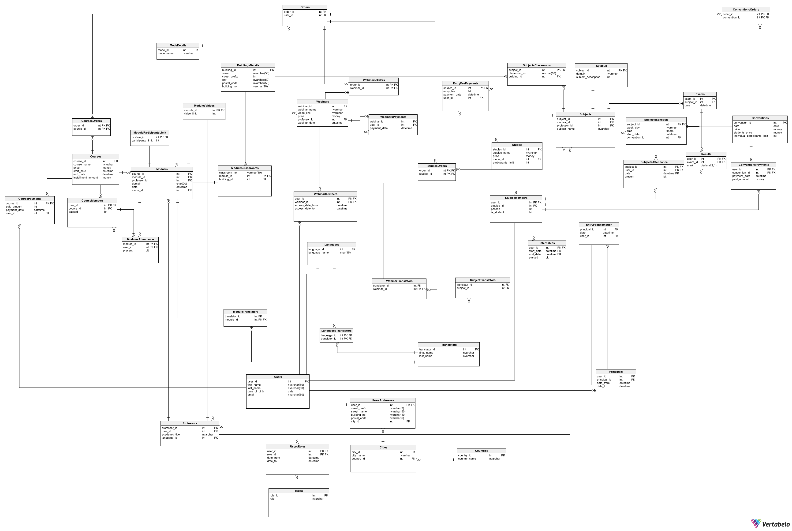

# training_company_database_system

This project is a database system for a training company that offers webinars, courses, and studies in various formats (online, hybrid, in-person).

## Functionalities
- System Administrator:
    - CRUD operations for user accounts
    - CRUD operations for webinars/courses/studies
    - Assigning permissions and managing roles
- Webinar/Course Participant/Student:
    - Signing up for webinars/courses/studies
    - Making payments
    - Cancellation of participation
    - Displaying the class schedule
- Lecturer:
    - Generating a list of participants
    - Creating syllabus
    - Generating attendance reports
    - Displaying the schedule of classes assigned to participants
    - Sending notifications and messages to participants
- System functionalities:
    - Automatic checking of the seat limit for a given course/webinar/study 
    - Calculating the cost of a particular paid course (webinar) depending on the type of class and tallying the basket
    - Removal of participants who have not paid for courses (webinars) on time
    - Generation of financial reports
    - Generation of attendance lists for each training session with date, first name, last name, and information on whether the participant was present or not
    - Generation of a bilocation report
    - Automatic completion of data on diplomas

## Project content:
- Database schema
- Database definition
- Sample data
- Integrity rules
- Views presenting the most important information and reports
- Stored procedures for data entry and configuration changes
- Functions that return essential quantitative information
- Triggers
- Indexes
- Roles and their permissions for operations, views, and procedures

## Databse schema
